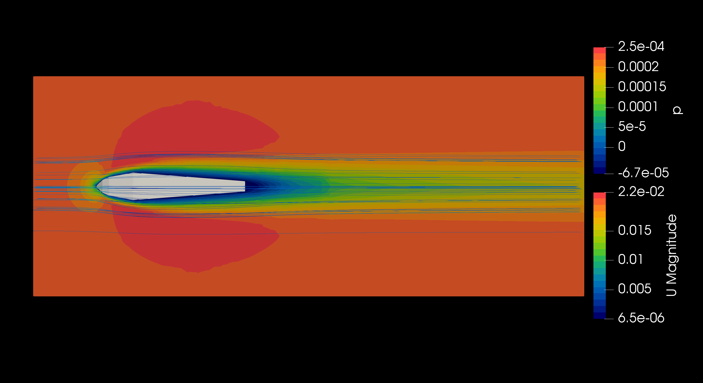

# Wind Tunnel Simulation of a streamlined body in OpenFOAM

This OpenFOAM case simulates a **steady-state wind tunnel test** for a random streamlined body defined by a CAD file (body.stl). The goal is to evaluate the aerodynamic performance, specifically calculating the **drag coefficient** of the body in a controlled airflow environment.

## Project Structure
- **/constant/triSurface directory/body.stl**: Contains the geometry of the test body.
- **/system, /constant, /0**: Standard OpenFOAM directories with setup files for boundary conditions, mesh, and solver configuration.
- **/gnuplot**: Contains a gnuplot script to plot the drag coefficient.
- **/postprocessing**: Contains simulation results.

## Running the simulation

Easy way: run ./Allrun

## Results and Analysis
- Processed results are stored in `/postprocessing` and in the time directories.
- Use the gnuplot script to visualize the evolution of Cd.

## Requirements
- **OpenFOAM** version compatible with the case files - Tested with v2012, but it must work with the majority of OpenFOAM.com versions.
- **Gnuplot** for plotting drag coefficient and residuals.

## Possible changes
- Change body.
- Increase wind tunnel size.
- Extend analysis to include lift and moment coefficients.
- Add transient case for time-dependent flow analysis.
- Refine mesh for increased accuracy in critical flow regions.

